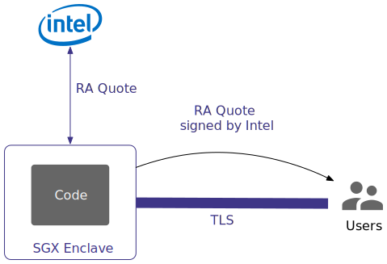
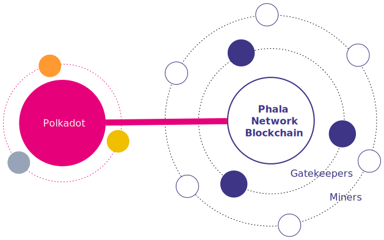
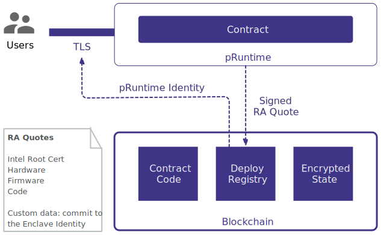
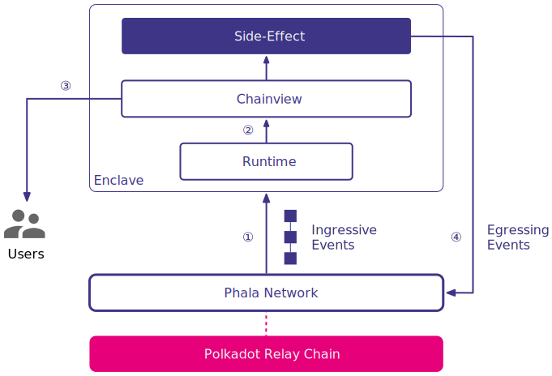
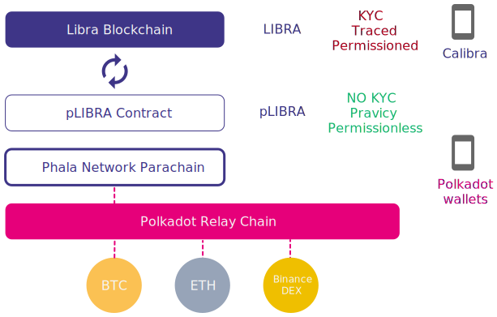
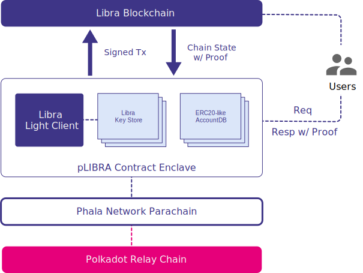

#    Phala Network

<div class="subtitle">A confidential smart contract network based on Polkadot (Draft)</div>
<p style="text-align: center">Sept 10, 2019</p>
<p style="text-align: center">Hang Yin, Shunfan Zhou, Jun Jiang</p>

[TOC]

## 1. Introduction

Nowadays the security of the permissionless blockchain is typically guaranteed by state replication over consensus algorithms. Though this approach works well for blockchain, it also means everything on the blockchain is publish, which brings a problem: confidential information can't be handled by the blockchain.

Several projects addressed the privacy problem. Monero and Zcash implemented private transaction by ring signature and zk-SNARK technology but it's limited to cryptocurrencies and hard to extend as general-purpose smart contracts. MPC (multi-party computing) can theoretically run arbitrary programs without revealing intermediate state to the participants but also introduces a performance overhead of $10^6$ times [ref: Ekiden].

Currently, pure software solutions are not viable. A new approach is to utilize special hardware. TEE (Trusted Execution Environment) is a special area in some processors that provides a higher level of security including isolated execution, code integration, and state confidentiality (https://en.wikipedia.org/wiki/Trusted_execution_environment). Naive TEE as a computing platform has several shortages such as the lack of availability guarantee. Ekiden [ref: Ekiden] fixed these problems by introducing a TEE-blockchain hybrid architecture and implemented high performance confidential smart contract. However, contracts in Ekiden are isolated, meaning the contracts cannot interoperate with each other, and cannot interoperate to external blockchains.

In this paper, we present Phala Network, a novel cross-chain interoperable confidential smart contract network based on Polkadot. We introduce an **Event Sourcing / CQRS** architecture into a TEE-blockchain hybrid system to archive cross-chain interoperability for the confidential smart contracts. We further designed a Libra-Polkadot bridge to implement a privacy-preserving Libra Coin by confidential contract.

## 2. Trusted Computing: Intel SGX

Intel SGX is a popular implementation of TEE (Trusted Execution Environment). It runs code inside a special "Enclave" so that the execution of the code is deterministic, i.e., not affected by other processes or underlying operating system, and the intermediate states is not leaked. In a properly set up system, Intel SGX can defend the attacks from the OS layer and hardware layer (https://www.intel.com/content/www/us/en/architecture-and-technology/software-guard-extensions.html).



<div style="text-align: center">Fig. Intel SGX RA</div>
To ensure the execution is finished as expected inside an enclave, a proof can be generated according to a protocol called **Remote Attestation** (https://software.intel.com/en-us/sgx/attestation-services). The hardware can generate an *attestation quote* based on the details of hardware, firmware, the code being executed inside the enclave, and other user-defined data produced by the code. The quote is signed by the trusted hardware with credentials embedded during the production process.

Next, the generated attestation quote is sent to the Intel Remote Attestation Service. Intel will sign the quote iff the signing credentials are valid. As each credential is uniquely bound to an Intel CPU unit, fake attestation quotes will never pass the Remote Attestation Service check.

Finally, the attestation quote signed by Intel serves as the proof of successful execution. It proves that specific code has been run inside an SGX enclave and produces certain output, which implies the confidentiality and the correctness of the execution. The proof can be published and validated by anyone with generic hardware.

Intel SGX and the Remote Attestation protocol is the foundation of Confidential Contract. Except for Intel SGX, there are also alternative implementation choices like AMD SEV and ARM TrustZone.

## 3. Confidential Contract

Phala Network aims to build a platform for general-purpose privacy-preserving Turing-Complete smart contracts. The basic requirements for such a platform could be as follows.

- Confidentiality

   Unlike the existing blockchains for smart contracts, Phala Network avoids the leakage of any input, output, or intermediate state of Confidential Contract. Only authorized queries to the contract will be answered.

- Code Integrity

   Anyone can verify that an output is produced by a specific smart contract published on the blockchain.

- State Consistency

   Anyone can verify that an execution happened at a certain blockchain height, which implies the output of the execution is subject to a certain chainstate.

- Availability

   There must not be a single point of failure such as disconnection of the miner.

The existing TEE solutions, e.g., Intel SGX, can only prevent the leakage of sensitive information during the execution of *isolated* programs, and provide no guarantee on availability or verification of input data. Thus it requires a carefully-designed infrastructure to integrate TEE into blockchain to meet the requirements above.

We are going to introduce the design of Phala Network and how it fulfills the above requirements in the following sections.

### 3.1. Abstraction of Confidential Contract

A typical smart contract can be regarded as a state machine of a current state $s_n$ and a state transition function $f$, which takes input event $e_n$ and last state $s_{n-1}$ to produce the latest state $s_n$:

$$
s_n = f(s_{n-1}, e_n)
$$

Since the state transition process happens inside the enclave, any of its intermediate states remains invisible to outside.
We can further encrypt the reached state and input event to prevent the attackers from inferring the internal state of contract with event replay.

Let $cs_n$ be the cipher of $s_n$ and $ce_n$ be the cipher of $e_n$, the state transition function of a Confidential Contract $p$ can be represented as:

$$
\begin{aligned}
          cs_n &= p(cs_{n-1}, ce_n) \\
  p(cs_n, ce_n) &= \mathrm{Enc}\bigg(f\big(\mathrm{Dec}(cs_n), \mathrm{Dec}(ce_n)\big)\bigg) \\
\end{aligned}
$$

where $\mathrm{Enc}$ and $\mathrm{Dec}$ can be carefully-chosen symmetric encryption and decryption functions subject to the contract.

Unlike the existing smart contract, a Confidential Contract doesn't expose any information outside the enclave by default. To answer authorized queries, we introduce a query function $q$ which takes the current encrypted state $cs_n$, query parameters $paras$ and user's identity $I$ (usually a pubkey) as input and returns the response $r$:

$$
r = q(cs_n, paras, I)
$$

The Confidential Contract must first validate the identity of the user and then respond to her query. Apart from the queries from users, the contract may also accept a special query producing side effects. The side effects include the egressing data that can be posted back to the blockchain by miners.

In this design, the executor (the enclave) is stateless, which greatly simplifies the design of the system. The events on the blockchain then become the canonical source of the inputs to the contract, which implies **Event Sourcing** design pattern. We further utilized the idea of **Command Query Responsibility Segregation** in the design of the protocol.

## 4. The Protocol

There are a few roles involved in the protocol.

- **Users** invoke, query and deploy smart contracts. Users interact with smart contracts via **Blockchain** and **Worker Nodes**. They can verify the blockchain as well as the cryptographic evidence on the blockchain independently by running a light client or full node. Special hardware is not needed.
- **Worker Nodes** run Confidential Contracts in TEE compatible hardware. Worker Nodes are off-chain. In each node, a special program called `pRuntime` is deployed to the enclave. The runtime has a builtin VM to run contracts. It also cooperates with the blockchain to support the contracts in full life cycle. Worker Nodes can be further divided into three roles:
  - **Genesis Node** helps bootstrap the network and set up the cryptographic configuration. There's only one Genesis Node and it's destroyed after the launch of Phala Network.
  - **Gatekeepers** manage the secrets to ensure the availability and security of the network. Gatekeepers are dynamically elected on the blockchain and they stake a large amount of Phala token. They are rewarded for being online and maybe slashed in case of misbehavior because there must be a certain number of the Gatekeepers running at any time.
  - **Miners** execute the Confidential Contracts. They get paid by selling their computing resources to the users. Unlike Gatekeepers, Miners need to stake just a small amount of the Phala token and can join & exit the network as they want.
- **Remote Attestation Service** is a public service to validate if a Worker Node has deployed `pRuntime` correctly. The cryptographic evidence produced by the service can prove a certain output is produced by `pRuntime` running inside a TEE. IAS is Intel SGX's remote attestation service implementation.
- **Blockchain** is the backbone of Phala Network. It stores the identities of the Worker Nodes, the published Confidential Contracts, the encrypted contract state, and the invocation transactions from users and other blockchains. When plugged into a Polkadot parachain slot, it's capable to interoperate with other blockchains through the Polkadot relay chain.



<div style="text-align: center">Fig. Roles in the protocol</div>
### 4.1. Worker Node Registration

All the Worker Nodes are required to be registered on the blockchain before participating in mining or Gatekeeper election.

Remote attestation provides a building block to verify the execution as well as its output of a certain code inside the enclave. Running such remote attestation on each execution is inefficient and can be avoided. In Phala Network we adopt a better protocol in which the attestation is only required once during the registration.



<div style="text-align: center">Fig. RA & Communication</div>
1. Worker node  $n$  (i.e. Miner or Gatekeeper) calls `pRuntime.GetIdentity` to generate a key pair as an identity $I_n(pk_n, sk_n)$.  $sk_n$ is kept inside the enclave and $pk_n$ is revealed to the node.
2. The worker node calls `pRuntime.GetRAQuote` to generate a remote attestation quote $q$ with the commitment to $pk_n$ and other necessary metadata.
3. The worker node submits $q$ to Remote Attestation Service and get the signed quotes $q_{signed}$.
4. The worker node submits $(q_{signed}, pk_n)$ to the blockchain. The blockchain then accepts and stores the information after validation.

With the identity registered, a TLS-like channel between the requester and the target `pRuntime` can be established. The identities published on the blockchain can serve as the PKI to avoid MitM attack. Note that not only the client can talk to `pRuntime` securely, but a secure channel between two runtime is also possible.

In a well established TLS connection, the two parties can trust each other without further need of remote attestation. Nobody can pretend to be a registered worker node because the corresponding `pRuntime` is the only party who has the private key to establish the TLS connection. This trick improves the efficiency and flexibility of code execution in the runtime. It's also widely used in the Phala Network protocol.

The metadata submitted to the blockchain also contains sufficient information to locate the access endpoint of the worker node, for example, libp2p multiaddrs.

### 4.2. Blockchain Launch

Genesis Node assists the launch of the blockchain until it finishes:

1. Before the genesis block, the Genesis Node runs `pRuntime.Bootstrap` to generate a key pair as the identity of the node, and a symmetric key, namely Genesis Identity $I_g(pk_g, sk_g)$ and Genesis Key $k_g$. The runtime reveals $pk_g$ but keeps $sk_g$ and $k_g$ privately.
2. Start the blockchain with $pk_g$. In this stage $pk_g$ is published in the genesis block and is used for other worker nodes to establish secure channels to the Genesis Node. $k_g$ is kept inside the Genesis Node and is used to store secrets necessary to run the network on the blockchain. A list of the initial Phala token distribution is hard-coded in the genesis block.
3. The blockchain is at pre-launch phase after the genesis block. Governance module is enabled but other modules including Confidential Contract are still disabled until the Gatekeepers are elected.
4. Worker Nodes who want to participate in Gatekeeper election can follow the **Worker Node Registration** scheme to register their identities on the blockchain. Then $n_{gk}$ (a chain parameter between tens to hundreds) Gatekeepers will be elected during the pre-launch phase. This can be done via an on-chain Polkadot-style NPoS validator election (see Appendix II for details).
5. When the election is finished, the Gatekeepers send a request to the Genesis Node for $k_g$ through a TLS connection. The Genesis Node only answers the requests from the selected Gatekeeper.
6. The Genesis Node retires and self destroys when all the Gatekeepers are ready.

So far $k_g$ has been distributed to all the Gatekeeper's runtime and Gatekeepers have their identity registered on the blockchain. Then $k_g$ will be used to deploy nodes and contracts in the future.

Periodical key rotation is necessary for forward secrecy. The latest key at epoch $n$ is denoted by **Root Key** $k_r^{(n)}$.

### 4.3. Deploy Worker Nodes

Both Miners and Gatekeepers have to follow the "Worker Node Registration" scheme to join the network. To ensure the service quality, all the worker nodes must stake a certain amount of the Phala token and **could be slashed** once it fails to meet the responsive requirements. We will discuss the details about staking and monitoring in "Responsiveness Monitoring" section.

As Gatekeepers store the root key and need to be always online, they have to meet a higher standard and need to stake a larger amount. They are rewarded for keeping online and could be slashed otherwise.

### 4.4. Deploy the Contract

The bytecode of the compiled contract is published on the blockchain and then loaded by a user-specified miner. The Gatekeepers generate a symmetric encryption key for each newly published contract. The key is shared with the corresponding miner for state encryption. More specifically:

1. The developer publish the contract to the blockchain
2. Once Gatekeepers notice the contract, they generate a corresponding contract key $k_c$ for contract state encryption
3. Gatekeepers save $k_c$ to the blockchain as a part of the chainstate encrypted with Root Key $k_r$
4. The developer finds an available miner to load the contract. The developer can either run his miner so that no extra fee is needed, or rent one from a resource market (see "Economic Design Paper" for more details).
5. The miner runtime connects to Gatekeeper through a TSL connection and asks for $k_c$ by `pRuntime.GetContractKey`.

The miner's `pRuntime` will use $k_c$ to encrypt the contract state and save it to the blockchain periodically. We will discuss the details in "Execute the Contract" and "State Recover" section.

### 4.5. Key Rotation

The Gatekeepers are re-elected periodically according to the election rule (Appendix II). Let $G_{n-1}$ and $G_n$ be the Gatekeepers set before and after the election at round $n$. The root keys will be rotated as follows:

1. The old Gatekeeper set $G_{n-1}$ validates the new set $G_n$
2. $G_{n-1}$ decrypts the state of the Gatekeepers with the old root key $k_r^{(n-1)}$
3. $G_n$ generates a new root key $k_r^{(n)}$ and retrieve the state from $G_{n-1}$
4. $G_n$ encrypts the state with $k_r^{(n)}$ and stores it to the blockchain
5. The runtime of the retired Gatekeepers will halt and destroy $k_r^{(n-1)}$
6. $G_n$ generates new contract keys and notify the miner to rotate the keys. Miners' runtime then will ask $G_n$ for contract key by `pRuntime.GateContractKey`

Root key and contract key rotation ensures the forward secrecy of the confidential state (for both Gatekeeper state and contracts state). The keys for the obsolete data are destroyed once the rotation is done.

### 4.6. Execute the Contract

We adopt an Event Sourcing / CQRS style architecture for the contract execution. Read queries and write commands are segregated.

The contract state is determined by the write commands which have multiple sources: user invocations, blockchain events, and ingressive messages from the relay chain. In a naive design, we ask all the write commands to be recorded explicitly on the blockchain. The commands are denoted by **Ingressive Events** to `pRuntime`. As the events on the blockchain are ordered naturally, the blockchain becomes a canonical source of events.



<div style="text-align: center">Fig. Execute the Contract</div>
1. The miner (host) ingests the ingressive events to the runtime by calling `pRuntime.SyncBlockchain`. The incoming events are paired with cryptographic evidence which is validated by a light-weight Substrate client inside `pRuntime`. It ensures the integrity of the incoming events.
2. The runtime picks out the events targeting the contract deployed inside and feeds the contract. The execution of the contract produces a view of the `Chainstate`, namely `Chainview`
3. At any time, users can query `Chainview` by `pRuntime.Query`. The identity of the caller is attached to the queries so that the contract can decide whether to answer or not based on its customized authorization policy. The response to the query includes the query result as well as a commitment to the current blockchain state (e.g. height) and the contract state. In other words, all the outputs are subject to a certain blockchain state.
4. The runtime also produces various side-effects which is accessible by `pRuntime.DumpSideEffect`. A basic kind of side-effect is the encrypted contract state update produced periodically by `pRuntime`. With the full contract state, a new miner doesn't need to sync the data by replaying the entire blockchain history. Another kind of side-effects is outgoing messages targeting other contracts or blockchains, namely **Egressing Events**. The ability to post messages to external entities is the building block for contract interoperability. The submitted events are eventually dispatched to the target contract, or other blockchains by the Polkadot ICMP (Interchain Message Passing, https://research.web3.foundation/en/latest/polkadot/ICMP/). Miners (host) are responsible to post the side-effects back to the blockchain.

To invoke a contract the user needs to generate a shared secret key with the miner who runs the contract. This can be done via a non-interactive Diffie-Hellman key exchange scheme with her private key and the miner's registered public key (https://www.sqi.at/resources/Schindler-2019-CIW-Distributed-Key-Generation-with-Ethereum-Smart-Contracts.pdf). The key is used for future communication and then the user can submit the encrypted payload to the blockchain. The invocation events are processed by `pRuntime` once they arrive at the miner node.

As invocation payloads are included in a block, the blockchain is naturally a canonical source of events. All the contract invocations initiated by users, smart contracts, and other blockchains are timestamped and treated equally by the executor. It therefore makes a unified interface for contract interoperability.

The downside of the architecture is that the confirmation of the commands happens after the confirmation of the block. The performance of the blockchain becomes the bottleneck for contract invocations. However, the read-only queries are made into the runtime directly and the performance is not bounded by the blockchain. This is possible because the queries don't modify the contract state.

Miners are responsible to ensure the communication between `pRuntime` and the blockchain. A monitoring scheme is needed to ensure the connectivity. In the worst case (e.g. miner shutdown) the contract execution can be resumed by another miner.

### 4.7. State Recover

A single miner is sufficient to run a contract. Though miners are incentivized to run contracts in the long term, the miner may still becomes unresponsive due to network or power outage rarely. In such a case another miner can recover the saved state from the blockchain and resume execution.

As mentioned in section "Execute the Contract", one of the side-effects produced by `pRuntime`  is the periodical contract state update. The dumped state is encrypted by $k_c$ and stored on the blockchain. In the case of miner unavailable, a new miner can recover the latest dumped contract state from the blockchain and decrypt it with $k_c$. After recovering the state, the runtime can further replay the rest of the events on the blockchain until reaches the chain tip.

### 4.8. Responsiveness Monitoring

Both Gatekeepers and miners are required to keep the responsiveness to keep the functionality of Phala Network. Gatekeepers have to maintain a high level of responsiveness because the root key is kept inside the Gatekeepers runtime and must be available at any time. As long as Gatekeepers can serve the contract key for miners, the availability of the contracts can be guaranteed. So unresponsive miners are not as harmful as unresponsive Gatekeepers to the system.

We adopt a Polkadot-like unresponsiveness detection algorithm (https://research.web3.foundation/en/latest/polkadot/slashing/amounts/#unresponsiveness). Both Gatekeepers and miners produce side-effects by their runtime. They have to at least post the state updates periodically to the blockchain within an interval. So all the submitted side-effects can be used as a counter of the online activities. Then we can determine if a node $n$ is unresponsive in an era by
$$
c_n < \frac{1}{4} \max\limits_{n'}{c_{n'}}
$$
where $c_n$ is the activity counter for node $n$ and $n'$ is all the connected worker nodes in the era. For the detailed design of slash, please refer to Economic Design Paper.

## 5. Open Questions

Security fallbacks:

- Alternative TEE hardware: Though we use Intel SGX as the reference for the current design, we don't make any assumptions about the hardware. Potential TEE hardware includes AMD SEV, ARM Turstzone, and some open-source implementations in progress. When we support any alternatives the different TEE can work together transparently.
- Contract key backup by secret sharing scheme: To avoid catastrophes where Intel SGX breaks entirely (e.g. Intel bans all the Remote Attestation request from our side), we can utilize a secret sharing scheme to distribute the Root Key to the Gatekeepers, or maybe two generations of the Gatekeepers. In such a case, we can wait for the deployment of an alternative TEE system. Then the secret holders can collaborate to ingest the key to recover the execution of Phala Network.

Optimizations:

- Event batching & async state commitment
- State storage prune
- Layer 2 state sharing

## 6. The First Application: pLIBRA

pLIBRA is a free and privacy-preserving Libra Coin built on Polkadot. It includes

- A bridge connecting Polkadot and Libra
- A privacy-preserving token pLIBRA 1:1 pegged to Libra Coin (KYC not needed)
- A confidential-preserving cross-chain interoperable DApp ecosystem for Libra users



<div style="text-align: center">Fig. pLIBRA Overview</div>
### 6.1. System Design

pLIBRA is implemented as a Confidential Contract on Phala Network. It implements a Libra light client and a ERC20-like token inside the Confidential Contract.

- **Libra Light Client**: A full light client which is capable to validate the Merkle proof of the chain state and sign transactions.
- **Key Store**: Stores the private keys for the collateral Libra accounts (i.e. *bank account*).
- **AccountDB**: Stores the pLIBRA accounts and the balance.



<div style="text-align: center">Fig. pLIBRA Architecture</div>
Confidential Contract allows the client to manage privkeys and sign transactions without utilizing computing-intensive cryptographic. Libra users can send their Libra Coin to pLIBRA's bank account and get 1:1 pLIBRA token and vice versa.

As the information of the pLIBRA accounts is hidden inside the enclave, the pLIBRA token gets privacy-preserving feature like Monero for free. Phala Network is designed to be launched as a parachain on Polkadot. So pLIBRA also gets the ability to interoperate with all the blockchains connected to Polkadot.

At the time of writing, Libra only has very limited smart contract functionality (only whitelisted contracts are allowed). So here we present a naive way to store Libra without the need to employ an advanced feature like multisig or smart contract. When the smart contract is launched on Libra, we can further improve the security of our design by adopting a multisig-style collateral.

- **Init**. During the init phase, pLIBRA contract generates a key pair and reveal the public key. Then an account on Libra blockchain serving as the **Bank Account** is registered with the public key. This is a one-off task done by pLIBRA team. Note that pLIBRA team doesn't have any control over the bank account because the private key is always kept inside the Confidential Contract.
- **Sync**. The Libra light client is responsible to parse and validate the blockchain data from Libra network. Though at the beginning pLIBRA team will proxy Libra blockchain data to pLIBRA, the blockchain data can be fed by any user. We expect that the pLIBRA end-users will proxy the Libra blockchain data to get their transaction executed. This can be done by a shared library in the wallets. (Side notes: Libra doesn't have a typical "blockchain" data structure. By saying blockchain data, we refer to the Libra ledger updates.)
- **Link Account**. To deposit Libra to the system for pLIBRA, linking the accounts is needed. The user links the address of his Libra account and a pLIBRA account with the signature signed by the key pair of both accounts. It proves that both accounts are owned by the user. After the link operation, deposit and withdraw can only happen between the linked accounts.
- **Deposit**. The user sends some Libra coins to the **Bank Account** and tells pLIBRA the transaction. Once it's confirmed by the Libra light client inside the contract, the same amount of pLIBRA will be issued to the linked pLIBRA account.
- **Withdraw**. The user can request to withdraw pLIBRA. The requested amount of pLIBRA is burned and it will produce a transaction to release the same amount of Libra to the linked address. To broadcast the transaction to Libra network, the pLIBRA contract maintains a sequence of the tx. When the withdraw requester asks for his withdraw tx, it returns all the "not yet executed" tx. The requester has to broadcast all the pending tx until his tx are executed.
- **Transfer**. Transferring pLIBRA token is an internal change in AccountDB. Users can transfer pLIBRA freely like any ERC-20 token. The transfer happens inside the pLIBRA contract and only the owner can access the transaction information.
- **Query**. Users can query the balance and the transaction history of his account. The query operation is a read of Chainview and thus it's not needed to interact with the blockchain.

## Appendix I. pRuntime

(WIP)

```c++
class pRuntime {
 public:  // global accessible

  // identity
  Pubkey Bootstrap();
  Pubkey GetIdentity();
  Quote GetRAQuote();
  // state sync
  SyncState GetBlockchainSyncState();
  SyncResult SyncBlockchain(BlockchainUpdate update);
  SideEffectUpdates DumpSideEffect();
  // contracts
  QueryResponse Query(Hash contract_id, QueryRequest request);
  
 protected:  // inter-runtime accessible

  Key GetRootKey();
  Key GetContractKey(Hash contract_id);
  
 private:  // internal accessible

  Privkey id_sk;
  Key root_key;  // gatekeeper only
  map<Hash, Key> gatekeeper_contract_keys;  // gatekeeper only
  map<Hash, Key> miner_known_cotract_keys;  // miner only
  ChainState state;
}
```

## Appendix II. Gatekeeper Election

(WIP)
